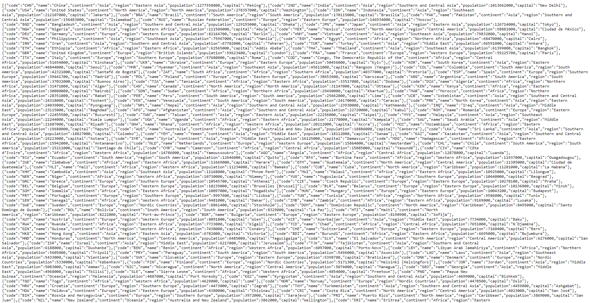
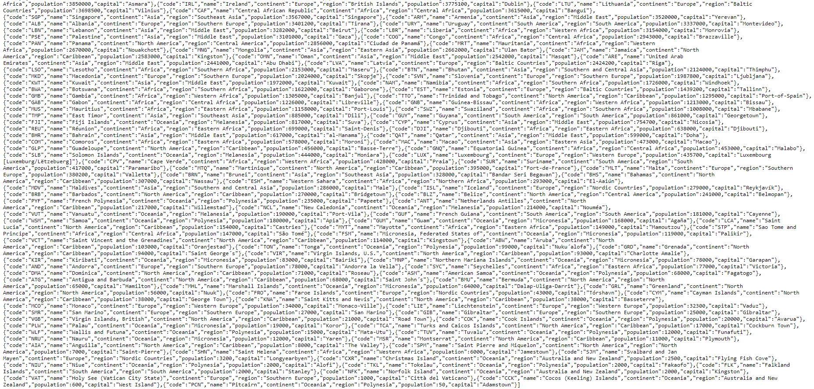
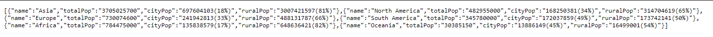
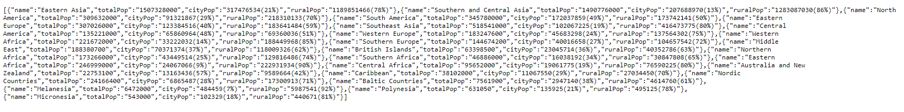
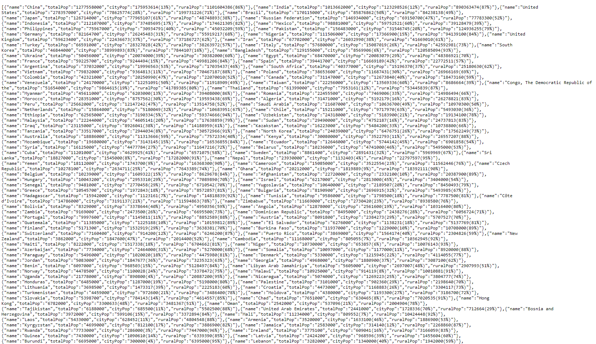
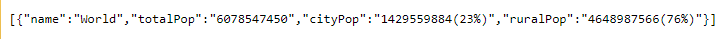
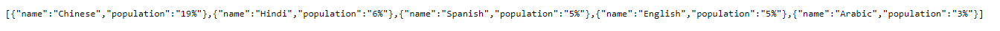

- Master Build Status 
    - Codecov 
- Develop Build Status 
    - Codecov 
- License 
- Release 

  

| ID          | Name        | Met         |  Screenshot |
| ----------- | ----------- | ----------- | ----------- |
| 1           | All the countries in the world organised by largest population to smallest.| Yes |     
| 2           | All the countries in a continent organised by largest population to smallest.| Yes | ")
| 3           | All the countries in a region organised by largest population to smallest.| Yes | ")
| 4           | The top N populated countries in the world where N is provided by the user.| No |
| 5           | The top N populated countries in a continent where N is provided by the user.| Yes | ")
| 6           | The top N populated countries in a region where N is provided by the user.| No |
| 7           | All the cities in the world organised by largest population to smallest.| Yes |
| 8           | All the cities in a continent organised by largest population to smallest.| Yes| ")
| 9           | All the cities in a region organised by largest population to smallest.| Yes |
| 10          | All the cities in a country organised by largest population to smallest.| Yes |
| 11          | All the cities in a district organised by largest population to smallest.| Yes |
| 12          | The top N populated cities in the world where N is provided by the user.| Yes |
| 13          | The top N populated cities in a continent where N is provided by the user.| Yes | 
| 14          | The top N populated cities in a region where N is provided by the user.| Yes |
| 15          | The top N populated cities in a country where N is provided by the user.| Yes |
| 16          | The top N populated cities in a district where N is provided by the user.| Yes |
| 17          | All the capital cities in the world organised by largest population to smallest.| Yes |
| 18          | All the capital cities in a continent organised by largest population to smallest.| Yes | ")
| 19          | All the capital cities in a region organised by largest to smallest.| Yes |
| 20          | The top N populated capital cities in the world where N is provided by the user.| No |
| 21          | The top N populated capital cities in a continent where N is provided by the user.| No |
| 22          | The top N populated capital cities in a region where N is provided by the user.| No |
| 23          | The population of people, people living in cities, and people not living in cities in each continent.| Yes | 
| 24          | The population of people, people living in cities, and people not living in cities in each region.| Yes | 
| 25          | The population of people, people living in cities, and people not living in cities in each country.| Yes |     
| 26          | The population of the world.| Yes | 
| 27          | The population of a continent.| Yes | ")
| 28          | The population of a region.| Yes | ")
| 29          | The population of a country.| Yes | ")
| 30          | The population of a district.| Yes | ")
| 31          | The population of a city.| Yes | ")
| 32          | The number of people who speak the following languages from greatest number to smallest, including the percentage of the world population:  Chinese, English, Hindi, Spanish, Arabic. | Yes | 